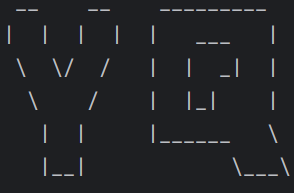

# Yq User Guide



## Introduction

***ChatBot Yq*** helps user to keep track of their **<ins>Todo</ins>**, **<ins>Deadline</ins>** and **<ins>Event</ins>** tasks. It allows user to _<ins>create</ins>_, _<ins>delete</ins>_, _<ins>find</ins>_, _<ins>mark</ins>_, 
_<ins>unmark</ins>_ and _<ins>view</ins>_ the list of tasks. Also, it can store and retrieve
saved tasks from a file called **saved_task_arraylist.txt** which will be created by the chatbot if the file does not 
exist in the computer. If the **saved_task_arraylist.txt** is present, the tasks from the file will be automatically passed into the chatbot once it starts running.

## Check task list
This allows user to ***view*** the tasks are currently present in the list.
The user is required to key in the word `list` <ins>**only**</ins>. Other extraneous parameters or details will be ignored.

Example: `list`

If the task list is not empty, it will be printed as such:

```
Here are the tasks in your list:
    1. [T][ ] read book
    2. [D][ ] return book (by: TUE 19-Dec-2023)
    3. [D][ ] return book (by: MON 01-Nov-2021 8.15am)
    4. [E][ ] project meeting (from: MON 15-Mar-2021 2.00pm to: FRI 02-Apr-2021)
```
Else, the user will be notified if the task list is empty.

## Create Todo Task
This allows user to ***create a Todo task*** which will then be automatically added into the task list.

The user is required to key in the word `todo` <ins>**followed by**</ins> _task description_. 

Parameter: `todo` _task description_

Example: `todo read book`

After keying in the above `todo` command, the output will be printed as such:

```
    'Todo' command is valid.

    Got it. I have added this task to the task list:
        [T][ ] read book
    Now you have 1 tasks in the list.
```
An error message will be printed accordingly if the `todo` command is invalid.

## Create Deadline Task
This allows user to ***create a Deadline task*** which will then be automatically added into the task list.

The user is required to key in the word `deadline` <ins>**followed by**</ins> _task description_, <ins>**then**</ins>`/by` and <ins>**lastly**</ins> _date_ (Time is optional.) **strictly** in this manner.

The format of the **date** and **time** input are `yyyy-MM-dd` and `HHmm` (24-HR format from `0000` to `2359`) respectively. If the day ```dd``` or month `MM` is single digit, please _**include**_ a `0` at the front: `1 -> 01`.

Parameter: `deadline` _task description_ `/by` _date_

Example: `deadline return book /by 2021-11-01 0815`

After keying in the above `deadline` command, the output will be printed as such:
```
    'Deadline' command is valid.

    Got it. I have added this task to the task list:
        [D][ ] return book (by: MON 01-Nov-2021 8.15am)
    Now you have 2 tasks in the list.
```
An error message will be printed accordingly if the `deadline` command is invalid.

## Create Event Task
This allows user to ***create an Event task*** which will then be automatically added into the task list.

The user is required to key in the word `event` <ins>**followed by**</ins> _task description_, <ins>**then**</ins>`/from`, _start date_, <ins>**then**</ins> `/to` and <ins>**lastly**</ins> _end date_ (Time is optional for both dates.) **strictly** in this manner.

The format of the **date** and **time** input are `yyyy-MM-dd` and `HHmm` (24-HR format from `0000` to `2359`) respectively. If the day ```dd``` or month `MM` is single digit, please _**include**_ a `0` at the front: `1 -> 01`.

Parameter: `event` _task description_ `/from` _start date_ `/to`_end date_

Example: `event project meeting /from 2021-03-15 1400 /to 2021-04-02`

After keying in the above `deadline` command, it will be printed as such:

```
    'Event' command is valid.

    Got it. I have added this task to the task list:
        [E][ ] project meeting (from: MON 15-Mar-2021 2.00pm to: FRI 02-Apr-2021)
    Now you have 3 tasks in the list.
```
An error message will be printed accordingly if the `event` command is invalid.

## Delete Task

This allows user to ***delete the task*** with the corresponding index from the task list.

The user is required to key in the word `delete` <ins>**followed by**</ins> _an integer_. The integer _should not contain any other characters_.

Parameter: `delete` _integer_

Example: `delete 2`

After keying in the above `delete` command, the output will be printed as such:
```
    Noted. I have removed this task:
        [D][ ] return book (by: MON 01-Nov-2021 8.15am)
    Now you have 2 tasks in the list.
```
An error message will be printed accordingly if the `delete` command is invalid.

## Find Task(s)
This allows user to _**find all the task(s)**_ with the corresponding word(s) from the task list.

The user is required to key in the word `find` followed by _word(s) that he/she is looking for_. 

Parameter: `find` _word(s) that the user is looking for_

Example: `find book`

After keying in the above `find` command, all the task(s) with the matching word(s) will be printed as such:

```
    Here are the matching tasks in your list:
        1. [T][ ] read book
```
An error message will be printed accordingly if the `find` command is invalid.

## Mark Task

This allows user to ***mark the task*** with the corresponding index from the task list.

The user is required to key in the word `mark` <ins>**followed by**</ins> _an integer_. The integer _should not contain any other characters_.

Parameter: `mark` _integer_

Example: `mark 1`

After keying in the above `mark` command, the output will be printed as such:
```
    The 'mark' command is valid.

    Nice! I've marked this task as done:
        [T][X] read book
```

An error message will be printed accordingly if the `mark` command is invalid.

## Unmark Task

This allows user to ***unmark the task*** with the corresponding index from the task list.

The user is required to key in the word `unmark` <ins>**followed by**</ins> _an integer_. The integer _should not contain any other characters_.

Parameter: `unmark` _integer_

Example: `unmark 1`

After keying in the above `unmark` command, the output will be printed as such:
```
    The 'unmark' command is valid.

    OK, I've marked this task as not done yet:
        [T][ ] read book
```

An error message will be printed accordingly if the `unmark` command is invalid.

## To Exit

To stop the program, the user is required to key in the word `bye` <ins>**only**</ins>. Other extraneous parameters or details will be ignored. The tasks in the list will be automatically saved in the **saved_task_arraylist.txt** file.

Example: `bye`

The output will be as such:
```
Processing...

    The following tasks have been saved into saved_task_arraylist.txt file: 
    1: [T][ ] read book
    2: [E][ ] project meeting (from: MON 15-Mar-2021 2.00pm to: FRI 02-Apr-2021)

    Bye. Hope to see you again soon!
```
